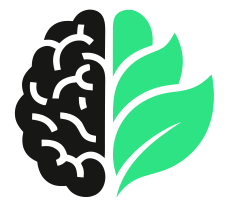

<div align="center">

# NeuraBreak



**Your personal health guardian for long desk sessions — 100% local, zero cloud.**

[](https://docs.ultralytics.com)
[](https://opencv.org)
[](https://doc.qt.io/qtforpython/)
[](LICENSE)
[](#installation)
[](https://github.com/astral-sh/ruff)

[Features](#features) · [Quick Start](#quick-start) · [Architecture](#architecture) · [Configuration](#configuration) · [Contributing](#contributing)

</div>

<br>

**Do you lose track of time at the desk?**  
Skipping breaks. Eyes glued to the screen for hours. Forgetting to move. NeuraBreak is built for that.

Your eyes, your back, and your mind deserve better than another all-nighter.

100% on-device — no cloud, no account, no data ever leaves your machine.


## ⭐ Support the Project

NeuraBreak is **free, open-source, and built out of a real personal problem** — too many hours at the desk, strained eyes, and a back that never lets you forget it.

No subscription. No account. No data collection. Just a quiet guardian running on your own machine.

If that's worth anything to you — even if you haven't tried it yet — **[a star on GitHub](https://github.com/abhijeetnishal/neurabreak)** helps more people find the project and keeps the motivation alive to keep building.


## Demo

https://github.com/user-attachments/assets/2c2e2add-cef6-46a9-b1ac-df92bbd12251


## Features

### 👁️ Eye Break Reminders (20-20-20 Rule)
- Fires an **auto-close overlay every 20 minutes** — look 20 ft away for 20 seconds to reduce eye strain
- One of the most evidence-backed habits for preventing digital eye fatigue
- Works entirely off a **face-presence timer** — no special hardware needed

### 🧠 Presence & Posture Detection
- Webcam-based **face detection** drives the session timer — the clock pauses the moment you step away
- Configurable **debounce window** (default: 2 s at 5 FPS) — a single flicker never triggers a false alert
- **Frame-skip optimisation** — pixel-diff threshold skips unchanged frames, saving CPU/GPU cycles
- GPU acceleration: CUDA, Apple MPS, and DirectML (AMD/Intel, Windows) auto-selected
- YOLO-based posture classification (**nano / small / medium** variants) flags `posture_good` vs `posture_bad`
- Tray icon turns **blue** while the AI model loads at startup so you always know the app is initialising
- > ⚠️ **Note:** Posture good/bad labels currently use the base YOLO model, **not** a custom-trained one. Accuracy will improve significantly once domain-specific training is complete (see [Roadmap](#roadmap)). Break reminders and eye breaks work reliably regardless.


### 🕐 Smart Break Scheduling
- Session timer with configurable interval (default: 45 min) — never skip a break again
- Full-screen break overlay with live countdown and movement prompts (walk, stretch, eye reset); **Snooze** button for when you're mid-thought

### 🚶 Smart Pause & Manual Pause
- **Auto-pause** — the session timer stops the moment you step away from your desk; resumes the instant you sit back down, no interaction needed
- **Manual pause** — right-click the tray icon and choose **Pause Monitoring** to immediately suspend all break reminders, eye alerts, and detection while you're in a meeting, presentation, or any focused session where you don't want interruptions; click **Resume Monitoring** to pick up exactly where you left off

### 🔔 Escalating Notifications
- Four-level escalation ladder: **gentle → assertive → persistent → overlay**
- OS-native toasts (Windows Notifications, macOS NSUserNotification, Linux libnotify)
- Non-blocking audio alerts; placeholder sounds auto-generated on first run if none are found

### 📊 Health Journal & Dashboard
- SQLite-backed session history — posture score, break compliance, time-at-desk
- **Four stat cards**: today's sessions, posture score, breaks taken, total sitting time
- **"Active Today" updates every 30 seconds** — reflects live elapsed time for the current session without needing a restart
- **Three custom charts** (pure QPainter — no extra chart library): hourly distribution, 7-day weekly trend, break compliance

### ⚙️ Settings & Controls
- **Five-tab settings dialog**: General, Notifications, Audio, Appearance, About
- **Live webcam preview** window with bounding-box overlay
- "Start with Windows" toggle — writes/removes the HKCU autostart registry key
- All settings write to TOML on save; the app hot-reloads within 5 seconds — no restart needed

### 🔒 Privacy by Design
- Camera is accessed **only while monitoring** — disabled at any other time
- No frames are stored on disk — ever
- No telemetry, no cloud calls, no account required

### 🔄 Auto-update Checker
- Background GitHub Releases check on startup — uses stdlib only, never blocks the UI
- Tray notification with a direct download link when a newer version is available
- Public GitHub release publishing is temporarily paused while the Windows installer is being stabilised; installer releases will return in a future update


## Quick Start

### Requirements

| Requirement | Minimum |
|---|---|
| Python | 3.11+ |
| [uv](https://docs.astral.sh/uv/) | Latest (recommended) |
| OS | Windows 10/11 · macOS 12+ · Linux with libappindicator |
| Webcam | Required for posture detection |

### Installation

```bash
git clone https://github.com/abhijeetnishal/neurabreak.git
cd neurabreak

# Minimal — tray icon + break reminders only (no AI)
uv sync

# With AI posture detection
uv sync --extra ai

# With audio alerts
uv sync --extra audio

# Full experience (posture AI + audio + health journal + OS notifications)
uv sync --extra full

# Everything including dev tools
uv sync --extra ai --extra audio --extra data --extra system --extra dev
```

### Run

```bash
uv run python -m neurabreak

# Start minimised to tray (used by autostart / installer)
uv run python -m neurabreak --minimized
```

A coloured dot appears in your system tray. Right-click it to access the full menu.

| Tray Colour | Meaning |
|-------------|---------|
| ⚫ Grey     | Idle / monitoring paused |
| 🔵 Blue     | Loading AI model (startup) or break active |
| 🟢 Green    | Monitoring — good posture |
| 🟡 Yellow   | Posture alert in progress |
| 🔴 Red      | Break due |


<!--
## Windows Installer (Temporarily Paused)

A standalone one-click installer is built with PyInstaller + Inno Setup for contributor validation.

> Public Windows installer publishing to GitHub Releases is currently paused due to stability issues. It will return in a future update.

### Build (for contributors)

Use this flow before opening a packaging-related PR:

```bash
# Install runtime + packaging dependencies used by the installer build
uv sync --extra full --extra packaging

# Build PyInstaller bundle → dist\NeuraBreak\
uv run pyinstaller packaging/windows/build.spec --noconfirm --clean

# Quick smoke test of the bundled exe (should launch without traceback)
dist\NeuraBreak\NeuraBreak.exe --minimized
dist\NeuraBreak\NeuraBreak.exe --quit

# Build full installer → dist\installer\NeuraBreak-0.1.0-Setup.exe
# Requires Inno Setup: https://jrsoftware.org/isinfo.php
iscc packaging/windows/installer.iss

# If `iscc` is not on PATH, call it directly:
"C:\Program Files (x86)\Inno Setup 6\ISCC.exe" packaging/windows/installer.iss
```

### Test The Installer

```powershell
# Install silently (writes a build log)
dist\installer\NeuraBreak-0.1.0-Setup.exe /VERYSILENT /NORESTART /LOG=installer.log

# Verify installed app launches
"$env:LOCALAPPDATA\NeuraBreak\NeuraBreak.exe" --minimized
"$env:LOCALAPPDATA\NeuraBreak\NeuraBreak.exe" --quit

# Optional cleanup test (silent uninstall)
"$env:LOCALAPPDATA\NeuraBreak\unins000.exe" /VERYSILENT /NORESTART
```

Minimum validation checklist for contributors:

- `dist\NeuraBreak\NeuraBreak.exe` starts with no startup traceback.
- `dist\installer\NeuraBreak-0.1.0-Setup.exe` installs successfully.
- Installed app starts and exits via `--quit`.
- Uninstaller runs successfully.

Pre-built Windows installers are temporarily not published on the [Releases page](https://github.com/abhijeetnishal/neurabreak/releases). Publishing will be re-enabled in a future update.
-->

## Architecture

```
src/neurabreak/
├── __main__.py              # entry point (--minimized / --quit CLI flags)
├── core/
│   ├── config.py            # Pydantic v2 settings · TOML backend · hot-reload
│   ├── events.py            # thread-safe pub/sub event bus
│   ├── logging.py           # structlog setup
│   ├── state_machine.py     # FSM: IDLE → MONITORING → POSTURE_ALERT → BREAK_DUE → BREAK_ACTIVE
│   ├── startup.py           # Windows autostart (HKCU Run registry key)
│   └── updater.py           # background GitHub Releases check (stdlib only)
├── ai/
│   ├── engine.py            # Ultralytics YOLO wrapper + ONNX stub fallback
│   ├── camera.py            # threaded webcam capture (OpenCV)
│   ├── preprocessor.py      # frame → tensor (letterbox + normalise)
│   ├── postprocessor.py     # raw detections → structured results (class parsing)
│   └── detection_service.py # inference thread: camera → engine → state machine
├── ui/
│   ├── app.py               # QApplication · wires all services via event bus
│   ├── tray.py              # system tray icon · colour-coded state feedback
│   ├── break_screen.py      # full-screen break overlay · 20-20-20 · movement prompts
│   ├── dashboard.py         # posture history charts (pure QPainter — no chart lib)
│   ├── settings.py          # 6-tab settings dialog · TOML write-on-save
│   └── preview.py           # live webcam preview with bounding-box overlay
├── data/
│   ├── models.py            # SQLAlchemy ORM (PostureEvent, Session, BreakRecord)
│   ├── database.py          # connection management · WAL mode · session context manager
│   └── journal.py           # health journal queries · session aggregation
└── notifications/
    ├── manager.py           # routes events → 4-level escalation ladder
    ├── audio.py             # non-blocking audio playback · auto-generated WAV placeholders
    ├── escalation.py        # tracks and advances escalation level
    └── platforms/           # OS-specific: windows.py · macos.py · linux.py
```

**Thread model:** Inference thread → State machine → Event bus → `QTimer.singleShot` → Qt main thread (tray, break overlay, dashboard). All UI updates are safe from background threads.


## Configuration

Config is auto-created at `~/.neurabreak/config.toml` on first launch and **hot-reloads within 5 seconds** — no restart needed.

```toml
[detection]
fps = 5                        # webcam capture rate (1–30)
confidence_threshold = 0.85
consecutive_frames = 10        # debounce: frames before alert fires (10 @ 5 FPS = 2 s)
model_variant = "nano"         # nano | small | medium
device = "auto"                # auto | cuda | mps | cpu
use_half = true                # FP16 on GPU (~2× speedup, CUDA only)
imgsz = 320                    # YOLO input resolution (320 = 4× cheaper than 640)
frame_skip_threshold = 8.0     # pixel-diff threshold to skip unchanged frames (0 = off)

[breaks]
interval_min = 45              # session length before break reminder (minutes)
duration_min = 5               # enforced break length (minutes)
smart_pause = true             # pause timer when you leave the desk
eye_break_interval_min = 20    # 20-20-20 rule interval
eye_break_duration_sec = 20    # 20-20-20 rule gaze duration

[ui]
theme = "auto"                 # system | light | dark | auto
start_minimized = false
```


## Development Setup

```bash
# Install all extras including dev tooling
uv sync --extra ai --extra audio --extra data --extra system --extra dev

# Install pre-commit hooks
uv run pre-commit install

# Run all 90 tests (80 unit + 10 integration)
uv run pytest tests/ -v

# Lint + format
uv run ruff check src/ tests/
uv run ruff format src/ tests/

# Type check
uv run mypy src/
```


## Roadmap

- [x] Real-time YOLO presence detection (nano / small / medium)
- [x] Smart pause — auto-detect desk absence
- [x] 20-20-20 eye break rule
- [x] Work break screen with walking & movement prompts
- [x] SQLite health journal + dashboard charts
- [x] 6-tab settings UI with hot-reload config
- [x] Live webcam preview with bounding-box overlay
- [ ] Windows one-click installer (PyInstaller + Inno Setup) — release publishing paused, coming soon
- [ ] Auto-update checker via GitHub Releases
- [ ] Windows autostart toggle
- [ ] **Custom-trained YOLO26 posture model** — collect & annotate 1000+ frames per class
- [ ] macOS packaging (`.app` bundle + DMG)
- [ ] Linux packaging (`.deb` / AppImage)
- [ ] Plugin system (custom audio packs, exercise routines, themes)


## Contributing

Meaningful contributions only — please read [CONTRIBUTING.md](CONTRIBUTING.md) before opening a PR.

> **Please avoid:** README/doc-only PRs, adding screenshots or GIFs, or cosmetic changes. Every PR should ship working code, features, or a real bug fix.

**High-value contributions:**

- 🐛 **Bug fixes** — open an [issue](https://github.com/abhijeetnishal/neurabreak/issues) first, then submit a PR with a regression test
- 💡 **Feature implementations** — discuss in an [issue](https://github.com/abhijeetnishal/neurabreak/issues) before building
- 🧠 **Custom model training** — annotate posture frames and contribute a trained YOLO26 `.pt` / `.onnx` model
- 🔌 **Platform support** — macOS / Linux packaging, native notification improvements
- ⚡ **Performance** — inference optimisation, frame pipeline improvements

```bash
# Fork + clone your fork
git clone https://github.com/<your-username>/neurabreak.git
cd neurabreak

# Create a feature branch
git checkout -b feature/my-awesome-feature

# Make changes, add tests, then commit
uv run pytest tests/ -v
git commit -m "feat: my awesome feature"

# Push and open a Pull Request
git push origin feature/my-awesome-feature
```


## License

[MIT](LICENSE) © 2026 NeuraBreak Contributors
